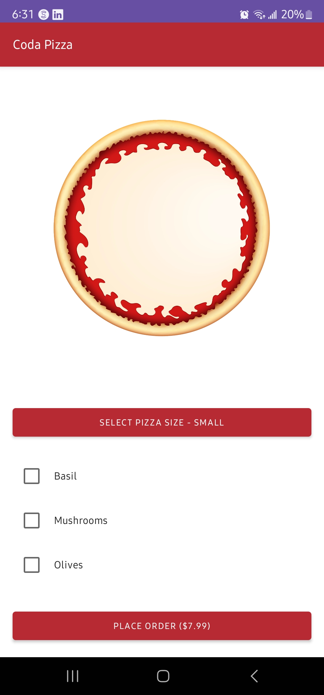
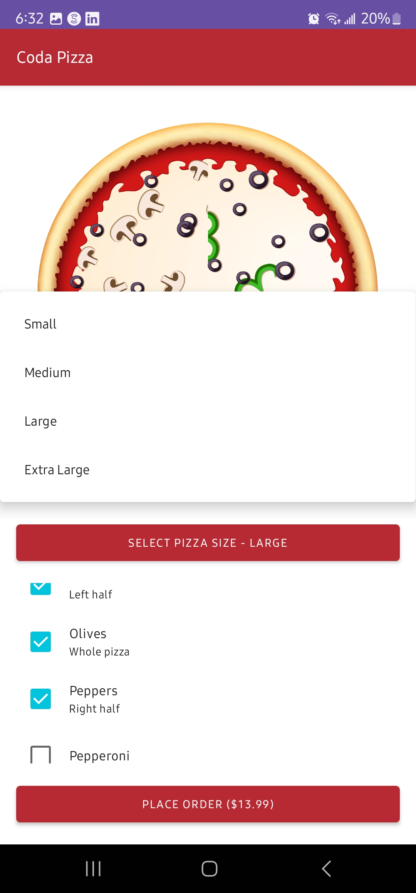
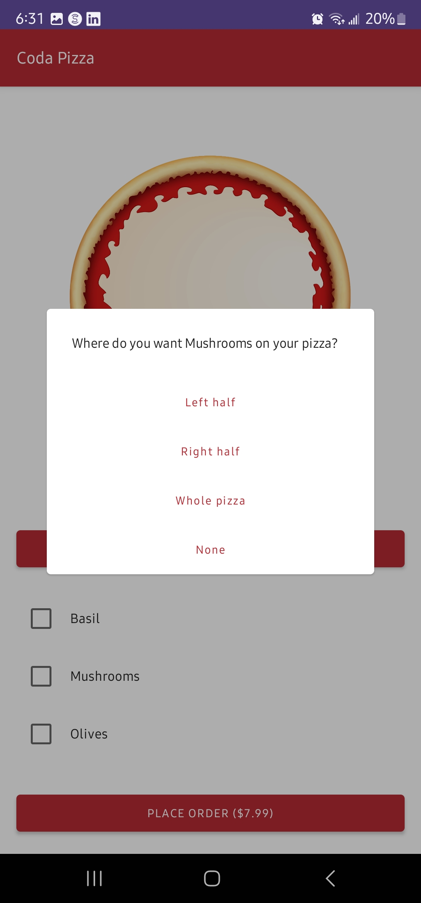
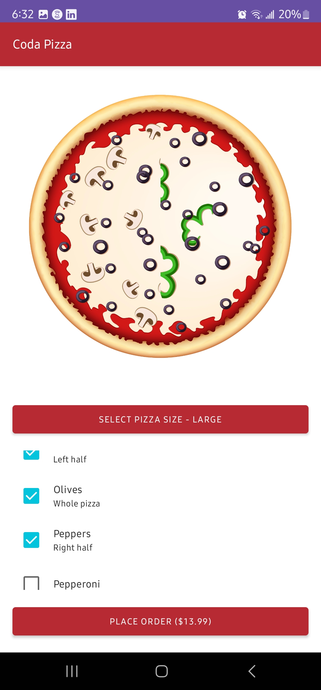
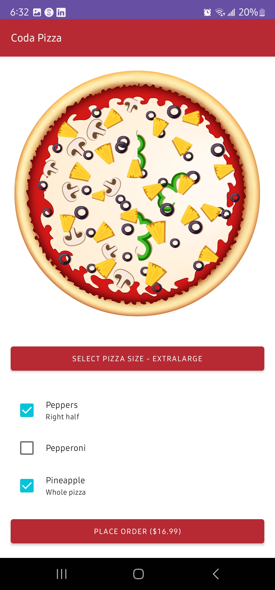

  # CodaPizza Application
- An interactive Jetpack Compose Pizza ordering application.
- Usercustomize pizza by adding multiple toppings and selecting size of the pizza.
- Can visualize the toppings added or removed on to the pizza lively.
- This is a practice application made with the help of text book [Android Programming: The Big Nerd Ranch Guide (5th Edition)](https://bignerdranch.com/books/android-programming-the-big-nerd-ranch-guide-5th-edition/).

## Main topics learnt through this project
- Using Jetpack Compose as UI instead of framework UI.
- Using inbuild composables and creating custom composables and previewing them.
- Using modifier, adding custom styles and adding click listeners to modifiers.
- Defining UI states and updating UI's with mutable state. Parcelable to store UI state.
- Usage of rememeber to store values and using state hoisting.
- Using lazy column as recyclerview and dialogs in compose.
- Theming compose UI's and using AppBar composable.
- Using Scafflod to hold composable properly on the screen.

## Download apk and have fun

[Download APK](https://github.com/yashwanthgajji/BNR-AD-CodaPizza/apk/codapizza.apk)

## Screenshots

&emsp;&emsp;&emsp;&emsp;
 
 
&emsp;&emsp;

## Video Usage

https://github.com/yashwanthgajji/BNR-AD-CodaPizza/assets/30505431/5a26136c-3dd4-435c-88c1-2affdb14a597

